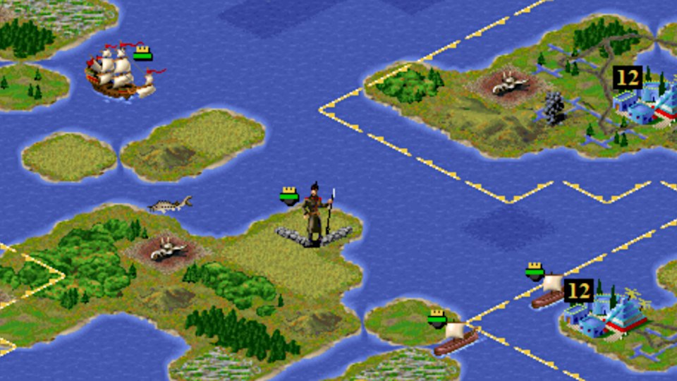

# C-evo: A Civilization 2 clone

# About C-evo

C-evo is a public domain Civilization 2 clone which was developed
until 2013.

This is a version of C-evo 1.2 (the final version of C-evo) with the
following changes:

* Many graphics made grayscale to save space (map and gameplay still
  full color)
* Sounds reduced to a small number of sounds (e.g. only one combat
  sound)
* Third party random map generator added (that generator is GPL, so
  source included in a separate file)
* Sizes for random maps changed, seven instead of six sizes
* Larger tiles removed; replaced with option to show or hide fog of
  war
* Fog of war tile overlay is less obnoxious
* A number of static maps, including two versions of Caulixtla, added

The size of most maps is based on having a correct surface area:

The surface area of a sphere is 4πr² so that in mind, the height
is πr and the width is 4r.  However, due to the isomorphic projection,
where each tile is twice as wide as tall, the height is 2πr and the
width 4r.

So, given a height y, x=2y/π (2\*y/pi), or likewise, for a given width
x, y=πx/2 (pi\*x/2).  Here x=4r and y=2πr giving a 4πr² surface
area (where the tiles are twice as wide as high).

This is made more complicated by the fact C-evo’s random map generator
requires xy+1 to be prime, and in addition since π is irrational, the
numbers are approximations.

The smallest map is based on the size of the tutorial map, which was
made wider because really narrow maps had rendering bugs in older
versions of C-evo, and the biggest map is the biggest map unmodified C-evo
supports, since the SETI AI author complained when I suggested
supporting even bigger maps.

One nice things about C-evo is that, even with the additional random
map generator, it fits nicely on an old school 1.44 meg floppy; that’s
how small this game is.

# Files

* [C-Evo that fits on a 1.44 meg floppy](cevo.7z)
* [Source code to map generator](mapgen-source.zip)
* [SETI AI for C-evo](seti.7z)

# Links

* [An up to date fork of C-evo](https://sourceforge.net/projects/c-evo-eh/)
